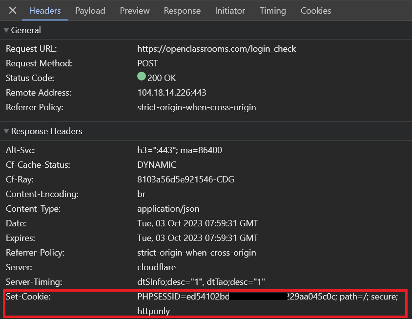

## Les sessions

Le principe des sessions Web en général repose sur les _cookies_. On parle dans ce cas de **cookies de session**.

Lorsqu'un utilisateur visite une page Web, le serveur Web peut lui attribuer un cookie en demandant à son navigateur de le stocker grâce à l'entête de réponse HTTP : `Set-Cookie`

<p align="center">
  
</p>

La gestion des sessions avec Express est simplifiée par le package NPM nommé : `express-session`

Ce package propose une fonction middleware dont le rôle va être de vérifier la présence d'un cookie de session, et de reconnaître son propriétaire d'une page à une autre. Si le cookie n'est pas présent, la fonction peut alors le créer.

```js
import session from 'express-session';
// (Ne pas oublier `npm install express-session`)

// …

// Middleware
app.use(session({
  name: 'MyApp Session', // Nom générique de la session
  secret: 'KEEP SECRET FROM CLIENT', // Chaîne permettant de signer le cookie
  resave: false,
  saveUninitialized: true
}));
```

> **Warning**
> Attention, l'utilisation des sessions en production comme présenté ci-dessus n'est pas une pratique conseillée en **production**.
> Cela est dû à la limite de mémoire sur un serveur Node.js.
> La solution est de déclarer un _store_ pour stocker les sessions en base de données. Nous verrons cela plus loin dans le cours.

On peut maintenant créer un compteur assez facilement à partir d'une route donnée :

```js
app.get('/', (req, res)=> {
  if( req.session.count  ){
    req.session.count++;
  }else{
    req.session.count = 1;
  }

  res.json({ message : "Hello World", count : req.session.count });
});
```

On peut également re-générez la session ou même la détruire à l'aide des méthodes suivantes :

```js
req.session.regenerate((err) =>{
  // will have a new session here
});

req.session.destroy((err) =>{
  // cannot access session here
});
```

## 02 Exercice counter redirection

Vous allez créez une petite application en partant du modèle **simple_00** et en utilisant les sessions. 

Toutes les réponses se feront en JSON.

1. Créez un compteur à chaque fois que l'on visite la page / (racine de l'app). Ajoutez +1 au compteur.

2. Une fois que le compteur arrive à 10 on redirigera l'utilsateur sur une page affichant le résultat (JSON).

Gestion de la redirection en Express :

```js
res.redirect('/check')
```

3. Une route **delete** permettra de remettre à jour le compteur, elle redirigera l'utilisateur sur la page d'accueil une fois le compteur.

## 03 TP projet de connexion (Challenge)

Vous allez partir du modèle model_complet_01 pour réaliser ce projet. Nous allons faire une page de connexion et une page "sécurisée" accessible uniquement après une connexion réussie. Il  n'y aura qu'un seul utilisateur.

Pour se connecter l'utilisateur devra renseigner son login/password.

Remarque : vous n'avez pas, pour l'instant, la possibilité de passer des données à la vue, nous verrons comment faire cela dans un prochain cours.  

1. Contrainte graphique : vous utiliserez un bootstrap ou un autre framework CSS, il suffit de récupérer les sources et de les placez dans le dossier public. Pensez à faire le nécessaire pour ces fichiers statiques.

2. Construisez un formulaire de connexion : login/password il s'affichera sur la page principale. Pour la gestion des mots de passe vous pouvez utiliser cryptoJS pour hasher le mot de passe.

3. Créez une page que nous allons "sécuriser" à l'aide d'un middleware/
