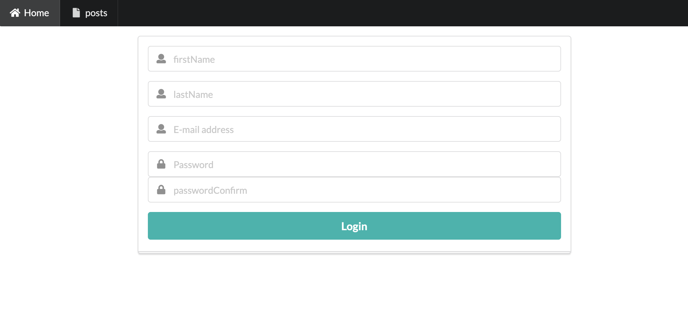
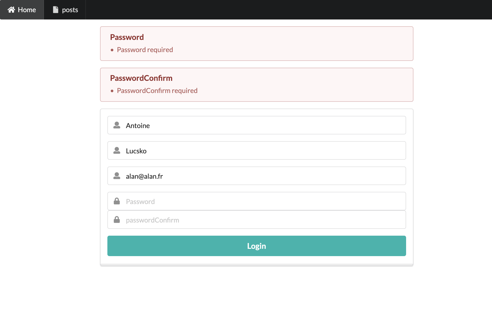
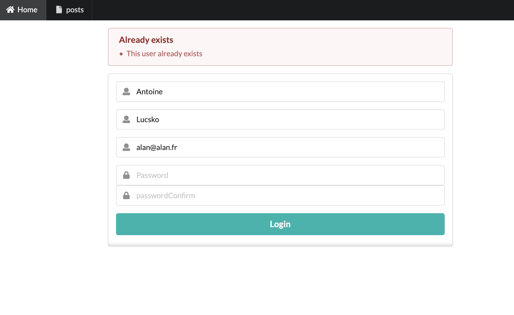
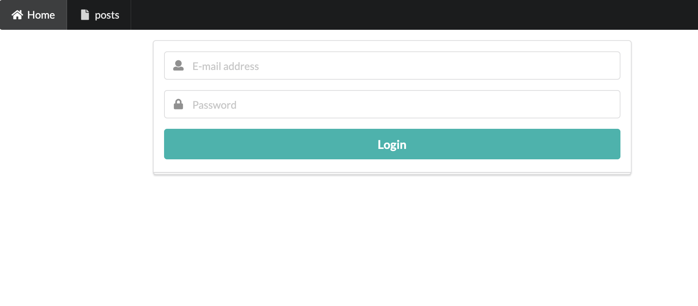

# Projet : Espace membres

## Objectifs

Vous devez créer un système d'inscription et de connexion à une application, en utilisant les notions abordées cette semaine en cours, à savoir :

- Serveur Express
- Middlewares
- Sessions
- Fichier d'environnement
- Templating
- MongoDB et Mongoose

> **Note**
> Ce projet **NE NÉCESSITE PAS** l'utilisation de JWT ni de cors() ! Vous traiterez les sessions de façon classique avec `express-session`, et utiliserez Pug comme moteur de template.

## Parcours utilisateur type

Un parcours utilisateur type pourrait ressembler à ceci :

1. Un nouvel utilisateur arrive sur la page d'accueil :
2. S'il n'est pas inscrit, il peut remplir un formulaire d'inscription
3. Ce formulaire doit être validé côté serveur avant l'enregistrement en base de données (vérifiez que l'utilisateur n'existe pas déjà)
4. Une fois l'utilisateur enregistré, il est redirigé vers la page de connexion d'où il peut s'authentifier
5. Une fois authentifié, l'utilisateur dispose d'une session et peut accéder à son tableau de bord personnel.

Dans ce TP vous devez partir du modèle Express `/model_complet_02/`, dans le dossier MODELES_SQUELETTES.

Vous travaillerez avec Git et ferez des commits réguliers et atomiques (pas de commits fourre-tout). N'oubliez pas de transmettre le lien vers votre Github à votre formateur !

Vous serez évalué sur la propreté et la qualité de votre code, ainsi que la maîtrise des notions abordées en cours cette semaine.

Vous êtes libre d'utiliser n'importe quel outil CSS front-end supplémentaire que vous jugerez nécessaire. Veillez à produire une interface utilisateur un minimum agréable et intuitive.

## Contraintes

- Vous devez utiliser un système classique de **sessions** pour gérer les utilisateurs connectés (JWT n'est pas nécessaire pour ce projet)
- Vous utiliserez **MongoDB** pour stocker les données de vos utilisateurs
- Vous utiliserez **Mongoose** pour interagir avec votre base de données depuis votre application Express

La structure-type **minimale** à adopter pour un document utilisateur est la suivante :

```js
// Modèle `User` de la collection `users`
{
  firstName  // type String, obligatoire
  lastName  // type String, obligatoire
  email  // type String, obligatoire
  password  // type String, obligatoire
}
```

> Vous êtes libre de rajouter des propriétés supplémentaires si vous le souhaitez

- Le mot de passe devra être haché avec un algorithme adéquat (ex: bcrypt ou argon2)

## Exemples de pages

### Page d'inscription

La page principale proposera le formulaire permettant d'enregistrer un nouvel utilisateur :



Vous devez vérifier les points suivants avant l'enregistrement :

-  Aucun des champs ne devra être vide, gérez les erreurs de saisies.

- Le choix du mot de passe devra être confirmé, gérez les erreurs de saisies.

Si il y a des erreurs de saisies, on ré-affichera le même formulaire avec les messages d'erreurs appropriées.



Vous devez également vérifier en base de données que l'utlisateur n'existe pas déjà.



Exemple avec la méthode `.findOne` de Mongoose pour faire une recherche à partir d'un modèle :

```js
// Users est votre modèle mongoose
try {
  const user = await Users.findOne({ email : email });

  if (user) {
    // User exists
  } else {
    // User doesn't exists
  }
} catch (err) {
  // Error handling
}
```

### Page de connexion

Une fois enregistré, l'utilisateur sera redirigé vers la page login.



L'utilisateur se connectera et sera alors re-dirigé si tout se passe bien vers la page Dashboard, sinon on lui ré-affichera la page de login.

### Dashboard

Cette page pourra afficher les informations que vous voulez sur l'utilisateur.

Mettez en place un middleware pour sécuriser l'accès à cette page.

### (Bonus) Utilisation de « flash messages »

Si vous en avez le temps, vous essaierez de mettre en place des "flash messages".

Un flash message survient à la suite d'une opération quelconque. Cela peut-être un message de succès, d'avertissement, d'information ou d'erreur.

```bash
npm install express-session
npm install connect-flash
```

Importez les classes suivantes (dépendances) :

```js
import session from "express-session";
import flash from "connect-flash";
```

Pour déclarer un flash message depuis un controller, vous devez utiliser la méthode `req.flash` juste avant d'effectuer une redirection :

```js
function PageController (req, res) {
  req.flash('success', 'Opération quelconque correctement effectuée !');
  res.redirect('/');
}
```

Afin que le serveur Express puisse obtenir les messages flash et les passer au template, il faut ajouter un middleware au fichier de serveur :

```js
app.use(session({ /* … */ }));

// "flash" doit impérativement être défini APRÈS le middleware de session
app.use(flash());

// Ce middleware personnalisé permet de passer les messages flash au template
app.use((req, res, next) => {
  res.locals.flash_success = req.flash("success"); // Consomme les messages flash
  next();
});
```

Par le biais de `res.locals.flash_success`, vous pourrez afficher le message flash dans votre template :

```pug
if flash_success
  .alert.alert-success
    each message in flash_success
      p= message
```
